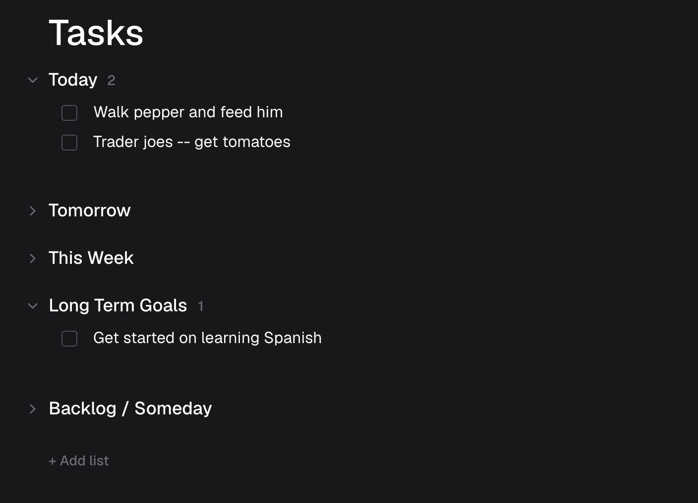

# minimal-todo

A clean, self-hostable todo list. **No account, no database, no backend** — your
tasks live entirely in your browser (IndexedDB). Deploy it once and it just
works, anywhere static files can be served.

<p align="center">
  
</p>

- ✅ Multiple lists with drag-to-reorder (lists and tasks)
- ✅ Collapsible lists, inline title editing, keyboard navigation
- ✅ Rich-text notes per task
- ✅ Completed-tasks history with restore
- ✅ Undo / redo
- ✅ Light & dark, mobile-friendly (bottom sheets)
- ✅ 100% static build — zero environment variables, zero services to provision

## One-click deploy

[](https://vercel.com/new/clone?repository-url=https://github.com/evanhu1/minimal-todo)

It builds to a fully static site (`output: "export"`), so it also drops onto
Netlify, Cloudflare Pages, GitHub Pages, or any S3/CDN bucket with no config.

## Run locally

```sh
npm install
npm run dev        # http://localhost:3000
```

Production build (emits a static site to `out/`):

```sh
npm run build
npm run start      # serves ./out via `npx serve`
```

## How it works

There is no server. State lives in an [immer](https://immerjs.github.io/immer/)
reducer and is hydrated from / saved to IndexedDB via
[`idb-keyval`](https://github.com/jakearchibald/idb-keyval). Editing a task
writes locally and persists (debounced) — that's the entire data flow.

| Concern | Where |
| --- | --- |
| Data model & reducer | `lib/workspace/` |
| Local persistence (IndexedDB) | `lib/workspace/local-store.ts` |
| UI (board, tasks, header, drag) | `features/workspace/` |
| App shell | `app/` |

### Your data is yours

Everything stays in *your* browser's IndexedDB. It does not sync across devices,
and clearing site data wipes it. Nothing is ever sent anywhere.

## Tech

Next.js (static export) · React 19 · TypeScript · Tailwind CSS v4 · dnd-kit ·
Tiptap · Radix UI · immer · idb-keyval. No runtime services, no env vars.

## License

MIT
